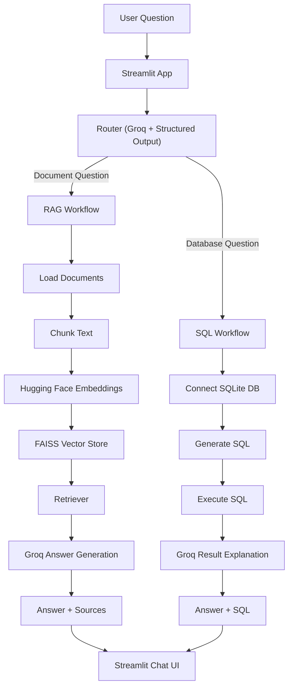

# Hybrid RAG + SQL Assistant

A Streamlit application that answers both document-based and database-based questions from a single chat interface.

This project combines:

- Retrieval-Augmented Generation (RAG) for `.txt` and `.pdf` documents
- Text-to-SQL for SQLite databases
- Groq for fast LLM inference
- Hugging Face embeddings for semantic retrieval
- FAISS for vector search

Users can work with the built-in hospital sample dataset or upload their own documents and SQLite database directly from the sidebar.

---

## Features

- Hybrid query routing between `RAG` and `SQL`
- Groq-powered structured routing and answer generation
- Hugging Face embeddings with FAISS vector search
- SQLite question answering using generated SQL
- Built-in hospital demo dataset
- User upload support for documents and databases
- Explainable outputs:
  - route used
  - route reason
  - source files for RAG answers
  - generated SQL for SQL answers
- Beginner-friendly code structure with interview-ready concepts

---

## Demo Use Cases

### Document Questions

- What is the visitor policy for ICU patients?
- When are refunds processed?
- How long do routine lab reports take?

### SQL Questions

- How many patients are registered from Delhi?
- Which doctor has the highest consultation fee?
- What is the total billing amount for paid bills?

---

## Architecture



---

## Project Structure

```text
.
├── app.py
├── rag_chain.py
├── sql_chain.py
├── requirements.txt
├── .env.example
├── data/
│   ├── docs/
│   ├── vectorstore/
│   └── database/
└── README.md
```

### Main Files

- `app.py`
  Main Streamlit UI, routing flow, sidebar controls, uploads, and chat display.

- `rag_chain.py`
  Handles document loading, chunking, embeddings, FAISS indexing, retrieval, and grounded answer generation.

- `sql_chain.py`
  Handles SQLite connection, SQL generation, execution, and natural-language answer creation.

---

## How It Works

### 1. RAG Workflow

The RAG branch is used for unstructured document questions.

Flow:

1. Load `.txt` and `.pdf` files
2. Split them into chunks
3. Generate embeddings with Hugging Face
4. Store embeddings in FAISS
5. Retrieve the most relevant chunks
6. Send question + retrieved context to Groq
7. Return answer + source files

### 2. SQL Workflow

The SQL branch is used for structured data questions.

Flow:

1. Connect to the active SQLite database
2. Generate SQL from the user question
3. Execute the SQL query
4. Convert the SQL result into a readable answer
5. Return answer + generated SQL

### 3. Query Routing

The router uses Groq with structured output to decide whether a query belongs to:

- `rag`
- `sql`

This keeps the app flexible while still giving explainable routing behavior.

---

## Built-In Sample Dataset

The app includes a hospital-themed default dataset for instant demo use.

### Default Documents

- `hospital_policy.txt`
- `billing_guidelines.txt`
- `hospital_faq.txt`

### Default SQLite Database Tables

- `departments`
- `doctors`
- `patients`
- `appointments`
- `admissions`
- `billing`

---

## User Upload Support

Users can also bring their own data through the sidebar.

### Supported Uploads

- Documents:
  - `.txt`
  - `.pdf`
- Databases:
  - `.db`
  - `.sqlite`
  - `.sqlite3`

### Important Note

After uploading documents, the user must click:

`Build / Refresh Vector Store`

This rebuilds the FAISS index from the uploaded files.

---

## Setup

### 1. Clone the Repository

```bash
git clone <your-repo-url>
cd <your-project-folder>
```

### 2. Create a `.env` File

Copy `.env.example` to `.env` and add your Groq API key.

```env
GROQ_API_KEY=your_groq_api_key
GROQ_MODEL=llama-3.1-8b-instant
EMBEDDING_MODEL=BAAI/bge-small-en-v1.5
```

### 3. Install Dependencies

```powershell
python -m pip install --user -r requirements.txt
```

### 4. Run the App

```powershell
python -m streamlit run app.py
```

---

## Using the App

### Option 1: Use the Built-In Hospital Data

1. Start the app
2. Click `Use Default Hospital Documents`
3. Click `Use Default Hospital Database`
4. Click `Build / Refresh Vector Store`
5. Ask a question

### Option 2: Use Your Own Data

1. Upload `.txt` / `.pdf` files in the Documents section
2. Click `Save Uploaded Documents`
3. Click `Build / Refresh Vector Store`
4. Upload a `.db` / `.sqlite` / `.sqlite3` file in the Database section
5. Click `Use Uploaded Database`
6. Ask a question

---

## Suggested Questions

### Document

`What is the visitor policy for ICU patients?`

### SQL

`How many patients are registered from Delhi?`

---

## Tech Stack

- Python
- Streamlit
- LangChain
- LangChain Classic
- Groq
- Hugging Face Embeddings
- FAISS
- SQLite
- Pydantic
- python-dotenv

---

## Current Limitations

- uploaded files are stored in local project folders
- uploaded databases replace the active SQLite database file
- SQLite is the only supported database right now
- Python 3.14 may show warnings with some LangChain ecosystem packages

---

## Future Improvements

- add per-user isolated workspaces
- add reset/clear upload actions
- support CSV and DOCX ingestion
- add SQL safety guardrails
- improve main chat answer cards and badges
- add Docker deployment files

---

## Screenshots

### Home Screen


### Sidebar and Upload Panel


### RAG Response Example


### SQL Response Example


---

## License

Jayantdeshwal License
